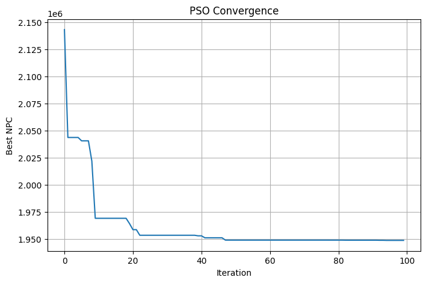
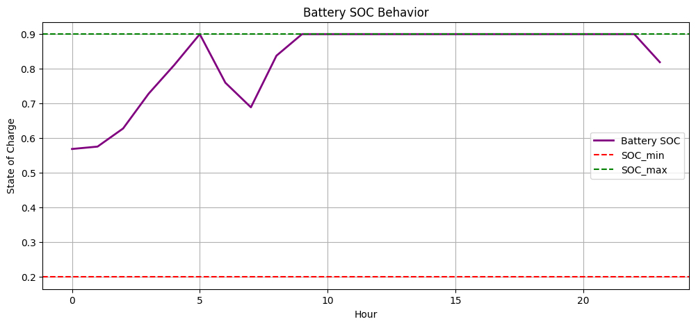
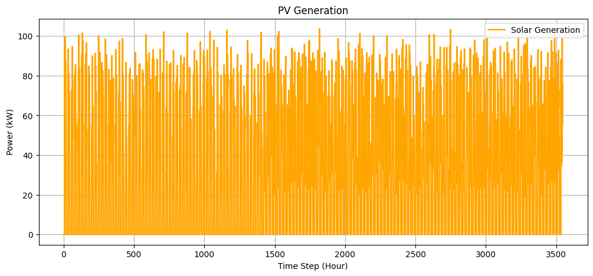
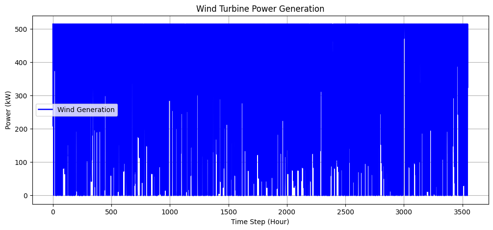
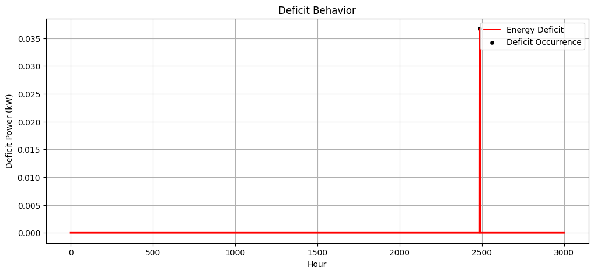

# AI-Based Hybrid Renewable Microgrid Optimization

AI-based optimization and comparative analysis of metaheuristic algorithms for optimal sizing and economic operation of a Solar–Wind–Battery Hybrid Renewable Energy System (HRES).

## Overview

This project presents a comparative analysis of AI-based metaheuristic optimization algorithms for the optimal sizing and economic operation of a Solar–Wind–Battery Hybrid Renewable Energy System (HRES).

The study evaluates multiple optimization algorithms using standard benchmark functions and a Net Present Cost (NPC)-based HRES optimization framework. Particle Swarm Optimization (PSO) was identified as the best-performing algorithm in the comparison and was subsequently used for HRES optimization.

## Objectives

- Optimize the sizing of a Solar–Wind–Battery Hybrid Renewable Energy System.
- Develop an AI-based optimization framework for HRES sizing.
- Minimize the Net Present Cost (NPC) of the hybrid renewable energy system.
- Compare the performance of different metaheuristic optimization algorithms.
- Analyze renewable generation, battery operation, state of charge (SOC), load demand, and energy deficit.

## System Configuration

The hybrid renewable energy system consists of:

- Solar Photovoltaic (PV) panels
- Wind Turbines (WT)
- Battery Energy Storage System (BES)
- Electrical Load

The optimization determines the appropriate number of PV panels, number of wind turbines, and battery capacity while minimizing the total system cost.

## Methodology

### 1. Benchmark Function Comparison

The optimization algorithms were initially evaluated using standard benchmark functions:

- Ackley Function
- Rastrigin Function

The convergence behavior and optimization performance of the algorithms were analyzed.

### 2. Metaheuristic Algorithm Comparison

The following algorithms were compared:

- Particle Swarm Optimization (PSO)
- Improved Particle Swarm Optimization (IPSO)
- Grey Wolf Optimizer (GWO)
- Adaptive/Modified optimization approach (ABSO)
- Genetic Algorithm (GA)
- Big Bang–Big Crunch (BB-BC)

The algorithms were compared using benchmark functions and an NPC-based HRES optimization problem.

### 3. PSO-Based HRES Optimization

Based on the comparison results, PSO was selected for the subsequent HRES optimization.

PSO was used to determine:

- Number of PV panels
- Number of wind turbines
- Battery capacity

The objective was to minimize the Net Present Cost (NPC) while satisfying the energy requirements of the system.

## Results

### Benchmark Function Results

#### Ackley Function


#### Rastrigin Function


### Algorithm Comparison

#### NPC-Based Algorithm Comparison


#### Comparison Table


## PSO-Based HRES Optimization Results

### PSO Convergence



### Generation vs Load


### Battery Dispatch Profile


### Battery State of Charge



### Solar Generation



### Wind Generation



### Load Profile


### Energy Deficit



## Optimal HRES Configuration

The PSO-based optimization resulted in the following configuration:

| Component | Optimal Configuration |
|---|---:|
| PV Panels | 303 |
| Wind Turbines | 257 |
| Battery Capacity | 2,870 kWh |
| Total NPC | $1,948,481 |

The PSO results correspond to the PSO row in the algorithm comparison results.

## Cost Model

The optimization considers the following component costs:

| Component | Capital Cost | Maintenance Cost |
|---|---:|---:|
| PV | $250 per panel | $5/year |
| Wind Turbine | $1,500 per turbine | $100/year |
| Battery | $400/kWh | — |

The objective function is based on the Net Present Cost (NPC) of the hybrid renewable energy system, including applicable penalty costs.

## Dataset

The project uses a renewable microgrid dataset containing time-series environmental and load information.

The dataset includes:

- `timestamp`
- `solar_irradiance`
- `wind_speed`
- `temperature`
- `humidity`
- `atmospheric_pressure`
- `grid_load_demand`

The dataset is available in:

`data/renewable_microgrid_dataset.csv`

## Repository Structure

```text
AI-Based-Hybrid-Renewable-Microgrid-Optimization/
│
├── README.md
├── LICENSE
├── .gitignore
│
├── data/
│   └── renewable_microgrid_dataset.csv
│
├── comparison/
│   └── notebooks/
│       ├── benchmark_function_comparison.ipynb
│       └── algorithm_comparison.ipynb
│
├── optimization/
│   └── notebooks/
│       └── pso_hres_optimization.ipynb
│
└── results/
    ├── comparison/
    │   ├── Ackley Result.png
    │   ├── Comparison Table.png
    │   ├── NPC Based Comparison Result.png
    │   └── Rastrigin Result.png
    │
    └── optimization/
        ├── Battery Dispatch Profile.png
        ├── deficit.png
        ├── Gen vs Load.png
        ├── load Profile.png
        ├── pso.png
        ├── SOC.png
        ├── solar.png
        └── wind.png
